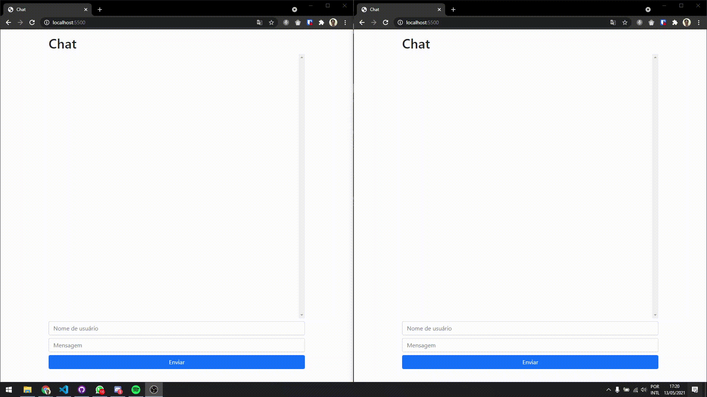

# 💬 Chat

## ℹ Sobre

Projeto desenvolvido durante a Formação NodeJS, com o intuito de fixar meus conhecimentos em NodeJS e aprendizado de Socket.io

Consiste em um chat simples com campos para nome de usuário e mensagem

## 🛠 Tecnologias Utilizadas

- NodeJS
- Express
- Socket.io
- EJS

## 🌐 Resultado



## 🤔 Como utilizar?

### Você precisa:

- NodeJS
- NPM ou Yarn

### Rodando:

```bash
# Instalando as dependências
$ yarn
# Rodando
$ yarn start
```

## 📄 Licença

Este projeto está hospedado sob a licença do MIT